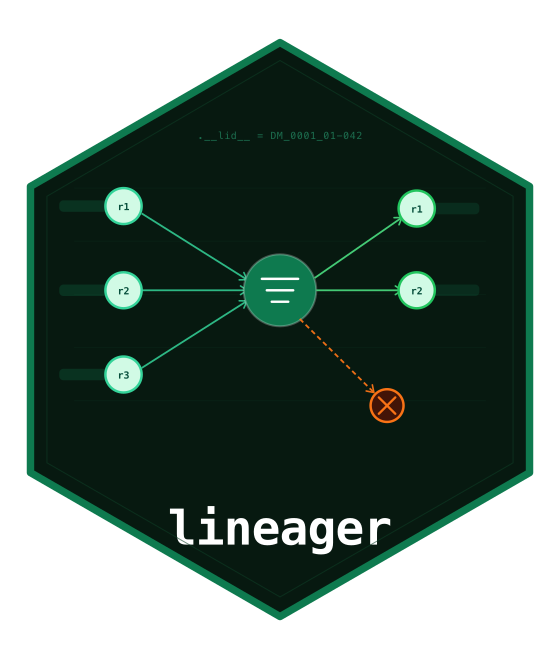

# lineager 

<!-- badges: start -->
[](https://github.com/repro-stats/lineager/actions/workflows/R-CMD-check.yaml)
[](https://app.codecov.io/gh/repro-stats/lineager)
<!-- badges: end -->

**Row-Level Data Provenance and Exclusion Tracking**

You build an analysis dataset. You filter it, join it, derive new
variables, and produce results. Somewhere along the way rows disappear.
Later, someone asks: *"Which records were excluded, why, and what
happened to record 01-042 between source and analysis?"*

Without `lineager`, that answer requires manual reconstruction.
With `lineager`, it is a single function call.

`lineager` tags every row of every dataset with a unique lineage
identifier that survives filters, joins, and derivations. Every row
removal must carry a documented reason. At any point, `lg_trace()`
returns any row's complete journey across the entire pipeline.
`lg_lineage()` visualises the full pipeline graph. `lg_report()`
compiles everything into a structured provenance document.

`lineager` is general-purpose: clinical data, machine learning,
financial modelling, epidemiology — any pipeline where row-level
accountability matters. CDISC-specific features (domain codes,
population flags, SDTM-to-ADaM mapping, Reviewer's Guide output) are
available as optional enrichment for pharmaceutical users.

## Installation

```r
# Install from GitHub
pak::pak("repro-stats/lineager")
```

## Quick start

```r
library(lineager)

# Start a tracked session
lg_start(study_id = "TRIAL-001", analysis_id = "primary")

# Use any data frame — here we simulate a small ADSL
adsl_raw <- data.frame(
  USUBJID = c("01-001", "01-002", "01-003", "01-004", "01-005"),
  ARMCD   = c("TRT", "TRT", "SCRNFAIL", "TRT", "TRT"),
  EXOCCUR = c("Y", "Y", "N", "Y", "N"),
  stringsAsFactors = FALSE
)

# Tag the dataset — every row gets a unique lineage identifier
adsl <- lg_tag(adsl_raw, dataset_id = "ADSL", domain = "DM",
               label = "Subject-Level Analysis Dataset")

# Derive variables with a documented reason
adsl <- lg_derive(adsl,
  RANDFL = ifelse(ARMCD != "SCRNFAIL", "Y", "N"),
  SAFFL  = ifelse(ARMCD != "SCRNFAIL" & EXOCCUR == "Y", "Y", "N"),
  description = "RANDFL: not a screen failure. SAFFL: randomised and dosed."
)

# Register the population definition before filtering
lg_population(
  adsl,
  flag_var      = "SAFFL",
  label         = "Safety Analysis Set",
  definition    = "Randomised subjects who received at least one dose",
  incl_criteria = c("Randomised (ARMCD != SCRNFAIL)", "Dosed (EXOCCUR = Y)")
)

# Filter with a mandatory exclusion reason — no silent row drops
adsl_safety <- lg_filter(
  adsl,
  SAFFL == "Y",
  reason      = "Not in safety population (SAFFL != 'Y')",
  reason_code = "NOT_SAFETY",
  population  = "SAFFL"
)

# Document a source-to-analysis variable derivation spec
lg_spec(
  dataset_id  = "ADSL",
  variable    = "SAFFL",
  label       = "Safety Analysis Set Flag",
  source_dom  = "DM",
  source_var  = "ARMCD",
  derivation  = "Y if ARMCD != 'SCRNFAIL' and EXOCCUR = Y, else N"
)

# Trace any subject's complete journey across the pipeline
lg_trace(adsl_safety$USUBJID[1L])

# Exclusion registry and disposition table
lg_exclusions()
lg_disposition(by = "reason")

# Visualise the full pipeline graph
# Requires DiagrammeR: install.packages("DiagrammeR")
# Without it, lg_plot() writes a .dot file you can render externally
lin <- lg_lineage()
lg_plot(lin)

# Generate a structured provenance report
lg_report(
  output  = tempfile(fileext = ".html"),
  title   = "Data Provenance Report",
  sponsor = "Sponsor name",
  author  = "Your name"
)

lg_end()
```

## Key functions

| Function | Purpose |
|---|---|
| `lg_start()` / `lg_end()` | Session lifecycle |
| `lg_tag()` | Tag a dataset with row-level lineage IDs |
| `lg_filter()` | Filter with mandatory exclusion reason |
| `lg_derive()` | Derive variables with documented description |
| `lg_join()` | Tracked join with bilateral row-ID tracing |
| `lg_population()` | Register a population or cohort definition |
| `lg_spec()` | Document a source-to-analysis variable derivation |
| `lg_trace()` | Trace a row's complete lineage journey |
| `lg_exclusions()` | Retrieve the full exclusion registry |
| `lg_disposition()` | Grouped exclusion summary table |
| `lg_operations()` | Full pipeline operation log |
| `lg_lineage()` | Build a pipeline lineage graph |
| `lg_plot()` | Render the lineage graph inline or export |
| `lg_report()` | Generate a structured HTML provenance report |

## The lineage ID

Every row carries a `lineage_id` column. For CDISC datasets with USUBJID:

```
DM_0001_01-042    # row 1 from DM domain, subject 01-042
ADLB_0047_01-042  # row 47 from ADLB, same subject
```

For general datasets:

```
patients_000001   # row 1 from the patients dataset
```

This ID persists through `lg_filter()`, `lg_derive()`, and `lg_join()`,
forming the traceable thread from any output row back to its source.

## CDISC features

For pharmaceutical and clinical users, `lineager` additionally supports:

- `domain` argument in `lg_tag()` for CDISC domain codes
- `lg_population()` for SAFFL, ITTFL, PPROTFL flag documentation
- `lg_spec()` for SDTM-to-ADaM variable derivation mapping
- `lg_report()` output aligned with CDISC Reviewer's Guide requirements

None of these are required for general use.

## Integration with regulog

`lineager` and `regulog` are complementary. Use `regulog` for a
tamper-evident session-level audit trail (who ran what, when, and why),
and `lineager` for row-level data provenance within that session. The
`lg_report()` output can be referenced in the `regulog` audit trail via
`log_action()`.
