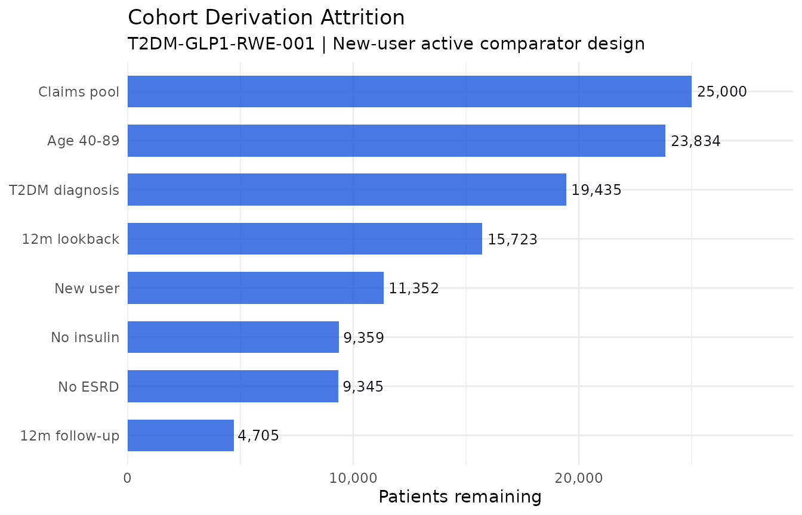
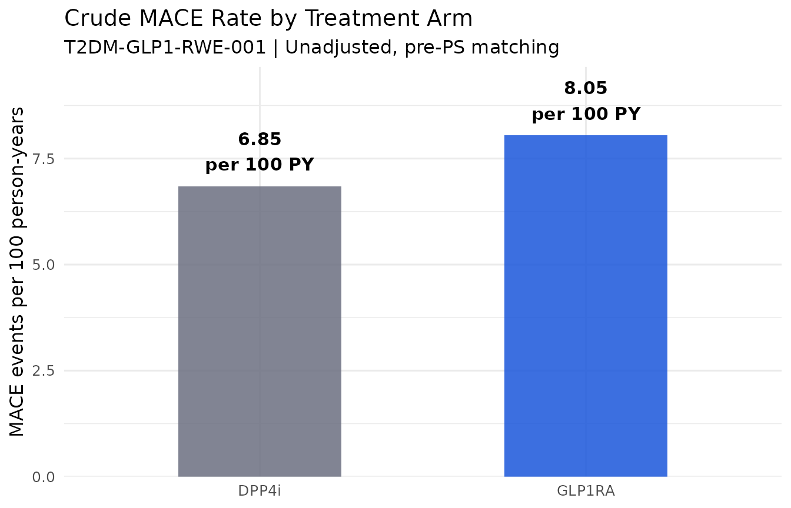

# Row-level provenance in real-world evidence studies

## Overview

Real-world evidence studies live or die by their cohort definition. The
new-user design, washout periods, lookback windows, prevalent user
exclusions, and outcome ascertainment rules are all critical analytical
decisions that HEOR reviewers, payers, and regulators scrutinise. Yet in
most RWE studies, the documentation of these decisions is at the
aggregate level: a CONSORT-style flow chart with total numbers at each
step.

`lineager` brings row-level traceability to RWE cohort derivation. Every
patient record carries a lineage ID. Every
[`lg_filter()`](https://reprostats.org/lineager/reference/lg_filter.md)
call requires a documented reason, and the session accumulates an
exclusion registry automatically as the pipeline runs. Any patient can
be traced through the complete cohort derivation — from raw claims to
the final analysis cohort — at any time.

This article demonstrates a complete new-user cohort derivation for a
retrospective comparative effectiveness study of two diabetes
medications in administrative claims data.

------------------------------------------------------------------------

## The study

A retrospective new-user active comparator study comparing GLP-1
receptor agonists (GLP-1 RA) versus DPP-4 inhibitors in adult patients
with type 2 diabetes newly initiating therapy. Primary outcome:
composite of major adverse cardiovascular events (MACE) at 12 months.

------------------------------------------------------------------------

## Setup

``` r

library(lineager)
library(dplyr)
```

    #> 
    #> Attaching package: 'dplyr'

    #> The following objects are masked from 'package:stats':
    #> 
    #>     filter, lag

    #> The following objects are masked from 'package:base':
    #> 
    #>     intersect, setdiff, setequal, union

``` r

library(ggplot2)
```

------------------------------------------------------------------------

## Simulate administrative claims data

``` r

n_pool <- 25000L  # Patient pool before eligibility screening

set.seed(2026)
claims_raw <- data.frame(
  PATID       = sprintf("PT-%07d", seq_len(n_pool)),
  INDEX_DATE  = as.Date("2022-01-01") +
                  sample(0:729, n_pool, replace = TRUE),
  AGE_INDEX   = round(rnorm(n_pool, mean = 61, sd = 12)),
  SEX         = sample(c("M", "F"), n_pool, replace = TRUE, prob = c(0.48, 0.52)),
  INDEX_DRUG  = sample(c("GLP1RA", "DPP4i"), n_pool, replace = TRUE,
                       prob = c(0.42, 0.58)),
  LOOKBACK_MO = sample(6:36, n_pool, replace = TRUE),
  T2DM_DX     = sample(c(TRUE, FALSE), n_pool, replace = TRUE, prob = c(0.82, 0.18)),
  PRIOR_USE   = sample(c(TRUE, FALSE), n_pool, replace = TRUE, prob = c(0.28, 0.72)),
  INSULIN_USE = sample(c(TRUE, FALSE), n_pool, replace = TRUE, prob = c(0.18, 0.82)),
  CKD_STAGE   = sample(c("NONE", "1-2", "3", "4", "5"),
                       n_pool, replace = TRUE,
                       prob = c(0.55, 0.18, 0.16, 0.08, 0.03)),
  HF_DX       = sample(c(TRUE, FALSE), n_pool, replace = TRUE, prob = c(0.14, 0.86)),
  ESRD        = sample(c(TRUE, FALSE), n_pool, replace = TRUE, prob = c(0.04, 0.96)),
  FOLLOW_MO   = round(runif(n_pool, min = 0.5, max = 24), 1),
  MACE_12M    = sample(c(TRUE, FALSE), n_pool, replace = TRUE, prob = c(0.07, 0.93)),
  stringsAsFactors = FALSE
)

claims_raw$MACE_12M[claims_raw$FOLLOW_MO < 12] <- FALSE
claims_raw$ESRD[claims_raw$CKD_STAGE != "5"] <- FALSE

cat(sprintf("Claims pool: %d patients\n", nrow(claims_raw)))
```

    #> Claims pool: 25000 patients

------------------------------------------------------------------------

## Start the lineager session

``` r

lg_start(study_id = "T2DM-GLP1-RWE-001", analysis_id = "new-user-cohort-derivation")
```

    #> lineager: session started [study: T2DM-GLP1-RWE-001] [analysis: new-user-cohort-derivation]

------------------------------------------------------------------------

## Tag the source dataset

[`lg_tag()`](https://reprostats.org/lineager/reference/lg_tag.md) embeds
a column named `USUBJID` into the lineage ID, when one is present, for
human-readable IDs. Administrative claims data conventionally uses a
different identifier (`PATID` here) — so we add a `USUBJID` column
purely for lineage embedding, while `PATID` remains the identifier used
throughout the actual analysis code.

``` r

claims_raw$USUBJID <- claims_raw$PATID

claims <- lg_tag(claims_raw, dataset_id = "CLAIMS_RAW", label = "Raw claims extract")
```

    #> lineager: tagged 'CLAIMS_RAW' — 25000 rows, 15 cols

``` r

cat(sprintf("Tagged %d patient records\n", nrow(claims)))
```

    #> Tagged 25000 patient records

``` r

head(claims[, c("lineage_id", "PATID", "INDEX_DRUG", "AGE_INDEX")], 4L)
```

    #> <lg_df> 'CLAIMS_RAW'  [4 × 4]
    #>        PATID INDEX_DRUG AGE_INDEX
    #> 1 PT-0000001      DPP4i        50
    #> 2 PT-0000002      DPP4i        59
    #> 3 PT-0000003     GLP1RA        71
    #> 4 PT-0000004     GLP1RA        70

------------------------------------------------------------------------

## New-user cohort derivation

Each eligibility criterion is a separate
[`lg_filter()`](https://reprostats.org/lineager/reference/lg_filter.md)
call with a documented reason. The exclusion registry and operation log
accumulate automatically — there is no separate disposition tracking to
maintain.

### Criterion 1: Age 40–89 at index date

``` r

cohort <- lg_filter(
  claims,
  AGE_INDEX >= 40L & AGE_INDEX <= 89L,
  reason     = "Eligible age range 40-89 years at index date per SAP Section 3.1. Excludes paediatric patients and those with extreme age where T2DM prevalence and drug indication differ substantially.",
  population = "AGE_ELIGIBLE"
)
```

    #> lineager: [CLAIMS_RAW] filter 'Eligible age range 40-89 years at index date per SAP Section 3.1. Excludes paediatric patients and those with extreme age where T2DM prevalence and drug indication differ substantially.' — 25000 in, 23834 out, 1166 excluded

``` r

cat(sprintf("After age criterion: %d patients\n", nrow(cohort)))
```

    #> After age criterion: 23834 patients

### Criterion 2: Type 2 diabetes diagnosis

``` r

cohort <- lg_filter(
  cohort, T2DM_DX == TRUE,
  reason     = "Require confirmed T2DM diagnosis (ICD-10 E11.x) in 12 months prior to index date per SAP Section 3.1.2.",
  population = "T2DM_CONFIRMED"
)
```

    #> lineager: [CLAIMS_RAW] filter 'Require confirmed T2DM diagnosis (ICD-10 E11.x) in 12 months prior to index date per SAP Section 3.1.2.' — 23834 in, 19435 out, 4399 excluded

``` r

cat(sprintf("After T2DM diagnosis criterion: %d patients\n", nrow(cohort)))
```

    #> After T2DM diagnosis criterion: 19435 patients

### Criterion 3: Minimum 12-month lookback

``` r

cohort <- lg_filter(
  cohort, LOOKBACK_MO >= 12L,
  reason     = "Require >= 12 months continuous enrolment prior to index date per SAP Section 3.2.",
  population = "LOOKBACK_ADEQUATE"
)
```

    #> lineager: [CLAIMS_RAW] filter 'Require >= 12 months continuous enrolment prior to index date per SAP Section 3.2.' — 19435 in, 15723 out, 3712 excluded

``` r

cat(sprintf("After lookback criterion: %d patients\n", nrow(cohort)))
```

    #> After lookback criterion: 15723 patients

### Criterion 4: New user — no prior use of index drug class

``` r

cohort <- lg_filter(
  cohort, PRIOR_USE == FALSE,
  reason     = "Exclude prevalent users: no dispensing of index drug class in the 12-month lookback period per SAP Section 3.3 (new-user design).",
  population = "NEW_USER"
)
```

    #> lineager: [CLAIMS_RAW] filter 'Exclude prevalent users: no dispensing of index drug class in the 12-month lookback period per SAP Section 3.3 (new-user design).' — 15723 in, 11352 out, 4371 excluded

``` r

cat(sprintf("After new-user criterion: %d patients\n", nrow(cohort)))
```

    #> After new-user criterion: 11352 patients

### Criterion 5: Exclude insulin users

``` r

cohort <- lg_filter(
  cohort, INSULIN_USE == FALSE,
  reason     = "Exclude patients on insulin at index date per SAP Section 3.4.",
  population = "NO_INSULIN"
)
```

    #> lineager: [CLAIMS_RAW] filter 'Exclude patients on insulin at index date per SAP Section 3.4.' — 11352 in, 9359 out, 1993 excluded

``` r

cat(sprintf("After insulin exclusion: %d patients\n", nrow(cohort)))
```

    #> After insulin exclusion: 9359 patients

### Criterion 6: Exclude end-stage renal disease

``` r

cohort <- lg_filter(
  cohort, ESRD == FALSE,
  reason     = "Exclude ESRD (CKD Stage 5 or renal replacement therapy) at or before index date per SAP Section 3.5.",
  population = "NO_ESRD"
)
```

    #> lineager: [CLAIMS_RAW] filter 'Exclude ESRD (CKD Stage 5 or renal replacement therapy) at or before index date per SAP Section 3.5.' — 9359 in, 9345 out, 14 excluded

``` r

cat(sprintf("After ESRD exclusion: %d patients\n", nrow(cohort)))
```

    #> After ESRD exclusion: 9345 patients

### Criterion 7: Minimum 12 months follow-up available

``` r

cohort <- lg_filter(
  cohort, FOLLOW_MO >= 12L,
  reason     = "Require >= 12 months follow-up from index date for the primary 12-month MACE outcome per SAP Section 3.6.",
  population = "FOLLOWUP_ADEQUATE"
)
```

    #> lineager: [CLAIMS_RAW] filter 'Require >= 12 months follow-up from index date for the primary 12-month MACE outcome per SAP Section 3.6.' — 9345 in, 4705 out, 4640 excluded

``` r

cat(sprintf("After follow-up criterion: %d patients\n", nrow(cohort)))
```

    #> After follow-up criterion: 4705 patients

------------------------------------------------------------------------

## Document the analysis population

[`lg_population()`](https://reprostats.org/lineager/reference/lg_population.md)
registers the cumulative cohort definition as a named population flag,
linking the SAP criteria to a single documented object.

``` r

cohort$NUC_FL <- "Y"  # all rows remaining at this point are the final cohort

lg_population(
  cohort,
  flag_var      = "NUC_FL",
  label         = "New-User Cohort Flag",
  definition    = "Adults aged 40-89 with confirmed T2DM, adequate lookback, new to index drug class, no insulin use, no ESRD, and adequate follow-up",
  incl_criteria = c("Age 40-89", "T2DM confirmed", ">=12mo lookback",
                    "New user of index drug", "No insulin", "No ESRD",
                    ">=12mo follow-up"),
  excl_criteria = "Any of the above criteria not met"
)
```

    #> lineager: population 'NUC_FL' (New-User Cohort Flag) — 4705 included, 0 excluded

------------------------------------------------------------------------

## Derive analysis variables

``` r

cohort <- lg_derive(
  cohort,
  CKD_MOD_SEV  = CKD_STAGE %in% c("3", "4"),
  HF_FLAG      = HF_DX == TRUE,
  HIGH_RISK_CV = (AGE_INDEX >= 65L) | (HF_DX == TRUE) | (CKD_STAGE %in% c("3","4","5")),
  description  = "Derive cardiovascular risk flags for propensity score model: CKD_MOD_SEV (Stage 3/4), HF_FLAG, composite HIGH_RISK_CV per SAP Section 5.2"
)
```

    #> lineager: [CLAIMS_RAW] derive — Derive cardiovascular risk flags for propensity score model: CKD_MOD_SEV (Stage 3/4), HF_FLAG, composite HIGH_RISK_CV per SAP Section 5.2

``` r

cohort <- lg_derive(
  cohort,
  STUDY_YEAR = as.integer(format(INDEX_DATE, "%Y")),
  description = "Derive index year for calendar time confounding adjustment"
)
```

    #> lineager: [CLAIMS_RAW] derive — Derive index year for calendar time confounding adjustment

``` r

cohort_final <- lg_derive(
  cohort,
  MACE_FLAG = MACE_12M == TRUE,
  description = "Derive primary outcome indicator from composite MACE endpoint at 12 months per SAP Section 4.1"
)
```

    #> lineager: [CLAIMS_RAW] derive — Derive primary outcome indicator from composite MACE endpoint at 12 months per SAP Section 4.1

------------------------------------------------------------------------

## Final cohort composition

``` r

cohort_char <- cohort_final |>
  group_by(INDEX_DRUG) |>
  summarise(
    N            = n(),
    Age_mean     = round(mean(AGE_INDEX), 1),
    Female_pct   = round(mean(SEX == "F") * 100, 1),
    HighRisk_pct = round(mean(HIGH_RISK_CV) * 100, 1),
    MACE_12m_pct = round(mean(MACE_FLAG) * 100, 1),
    .groups      = "drop"
  )

knitr::kable(
  cohort_char,
  col.names = c("Treatment", "N", "Age (mean)", "Female (%)",
                "High CV risk (%)", "MACE 12m (%)"),
  caption   = "Final cohort characteristics — T2DM-GLP1-RWE-001"
)
```

| Treatment |    N | Age (mean) | Female (%) | High CV risk (%) | MACE 12m (%) |
|:----------|-----:|-----------:|-----------:|-----------------:|-------------:|
| DPP4i     | 2743 |       62.1 |       51.9 |             63.7 |          6.9 |
| GLP1RA    | 1962 |       61.4 |       48.8 |             61.4 |          8.1 |

Final cohort characteristics — T2DM-GLP1-RWE-001 {.table}

------------------------------------------------------------------------

## Exclusion registry and attrition

[`lg_exclusions()`](https://reprostats.org/lineager/reference/lg_exclusions.md)
returns the row-level exclusion registry.
[`lg_operations()`](https://reprostats.org/lineager/reference/lg_operations.md)
returns the operation-level log with `rows_in`/`rows_out` at each step —
the right source for an attrition waterfall.

``` r

excl <- lg_exclusions()
```

    #> lineager: 20295 exclusion(s) retrieved

``` r

excl |>
  count(population, reason) |>
  knitr::kable(
    col.names = c("Population gate", "Reason", "N excluded"),
    caption   = "Cohort derivation exclusion registry — T2DM-GLP1-RWE-001"
  )
```

| Population gate | Reason | N excluded |
|:---|:---|---:|
| AGE_ELIGIBLE | Eligible age range 40-89 years at index date per SAP Section 3.1. Excludes paediatric patients and those with extreme age where T2DM prevalence and drug indication differ substantially. | 1166 |
| FOLLOWUP_ADEQUATE | Require \>= 12 months follow-up from index date for the primary 12-month MACE outcome per SAP Section 3.6. | 4640 |
| LOOKBACK_ADEQUATE | Require \>= 12 months continuous enrolment prior to index date per SAP Section 3.2. | 3712 |
| NEW_USER | Exclude prevalent users: no dispensing of index drug class in the 12-month lookback period per SAP Section 3.3 (new-user design). | 4371 |
| NO_ESRD | Exclude ESRD (CKD Stage 5 or renal replacement therapy) at or before index date per SAP Section 3.5. | 14 |
| NO_INSULIN | Exclude patients on insulin at index date per SAP Section 3.4. | 1993 |
| T2DM_CONFIRMED | Require confirmed T2DM diagnosis (ICD-10 E11.x) in 12 months prior to index date per SAP Section 3.1.2. | 4399 |

Cohort derivation exclusion registry — T2DM-GLP1-RWE-001 {.table
style="width:100%;"}

``` r

ops <- lg_operations() |> filter(op_type == "FILTER")

waterfall <- data.frame(
  label = c("Claims pool", ops$description),
  n     = c(n_pool, ops$rows_out),
  stringsAsFactors = FALSE
)
waterfall$label_short <- c(
  "Claims pool", "Age 40-89", "T2DM diagnosis", "12m lookback",
  "New user", "No insulin", "No ESRD", "12m follow-up"
)
waterfall$step_num <- seq_len(nrow(waterfall))

ggplot(waterfall, aes(x = reorder(label_short, -step_num), y = n)) +
  geom_col(fill = "#1a56db", alpha = 0.8, width = 0.65) +
  geom_text(aes(label = scales::comma(n)), hjust = -0.1, size = 3.2, colour = "#0f1117") +
  coord_flip() +
  scale_y_continuous(labels = scales::comma, expand = expansion(mult = c(0, 0.18))) +
  labs(
    title    = "Cohort Derivation Attrition",
    subtitle = "T2DM-GLP1-RWE-001 | New-user active comparator design",
    x = NULL, y = "Patients remaining"
  ) +
  theme_minimal(base_size = 11)
```



------------------------------------------------------------------------

## CONSORT-style disposition

[`lg_disposition()`](https://reprostats.org/lineager/reference/lg_disposition.md)
summarises the exclusion registry automatically, derived from every
[`lg_filter()`](https://reprostats.org/lineager/reference/lg_filter.md)
call above — there is no separate group definition to maintain.

``` r

lg_disposition(by = "population")
```

    #>               group n_excluded
    #> 1 FOLLOWUP_ADEQUATE       4640
    #> 2    T2DM_CONFIRMED       4399
    #> 3          NEW_USER       4371
    #> 4 LOOKBACK_ADEQUATE       3712
    #> 5        NO_INSULIN       1993
    #> 6      AGE_ELIGIBLE       1166
    #> 7           NO_ESRD         14

------------------------------------------------------------------------

## Trace a patient

``` r

example_pat <- cohort_final$PATID[1L]
lg_trace(example_pat)
```

    #> 
    #> ── lineager trace: USUBJID 'PT-0000017' ──
    #> 
    #>   Appears in: CLAIMS_RAW
    #> 
    #>   Operations:
    #>     [FILTER] CLAIMS_RAW: Eligible age range 40-89 years at index date per SAP Section (25000→23834)
    #>     [FILTER] CLAIMS_RAW: Require confirmed T2DM diagnosis (ICD-10 E11.x) in 12 months (23834→19435)
    #>     [FILTER] CLAIMS_RAW: Require >= 12 months continuous enrolment prior to index dat (19435→15723)
    #>     [FILTER] CLAIMS_RAW: Exclude prevalent users: no dispensing of index drug class i (15723→11352)
    #>     [FILTER] CLAIMS_RAW: Exclude patients on insulin at index date per SAP Section 3. (11352→9359)
    #>     [FILTER] CLAIMS_RAW: Exclude ESRD (CKD Stage 5 or renal replacement therapy) at o (9359→9345)
    #>     [FILTER] CLAIMS_RAW: Require >= 12 months follow-up from index date for the prima (9345→4705)
    #>     [DERIVE] CLAIMS_RAW: Derive cardiovascular risk flags for propensity score model: (4705→4705)
    #>     [DERIVE] CLAIMS_RAW: Derive index year for calendar time confounding adjustment (4705→4705)
    #>     [DERIVE] CLAIMS_RAW: Derive primary outcome indicator from composite MACE endpoin (4705→4705)
    #> 
    #>   Exclusions: none
    #> 
    #>   Registered populations:
    #>     NUC_FL: New-User Cohort Flag

``` r

excluded_pat <- claims_raw$PATID[claims_raw$T2DM_DX == FALSE][1L]
lg_trace(excluded_pat)
```

    #> 
    #> ── lineager trace: USUBJID 'PT-0000002' ──
    #> 
    #>   Appears in: CLAIMS_RAW
    #> 
    #>   Operations:
    #>     [FILTER] CLAIMS_RAW: Eligible age range 40-89 years at index date per SAP Section (25000→23834)
    #>     [FILTER] CLAIMS_RAW: Require confirmed T2DM diagnosis (ICD-10 E11.x) in 12 months (23834→19435)
    #>     [FILTER] CLAIMS_RAW: Require >= 12 months continuous enrolment prior to index dat (19435→15723)
    #>     [FILTER] CLAIMS_RAW: Exclude prevalent users: no dispensing of index drug class i (15723→11352)
    #>     [FILTER] CLAIMS_RAW: Exclude patients on insulin at index date per SAP Section 3. (11352→9359)
    #>     [FILTER] CLAIMS_RAW: Exclude ESRD (CKD Stage 5 or renal replacement therapy) at o (9359→9345)
    #>     [FILTER] CLAIMS_RAW: Require >= 12 months follow-up from index date for the prima (9345→4705)
    #>     [DERIVE] CLAIMS_RAW: Derive cardiovascular risk flags for propensity score model: (4705→4705)
    #>     [DERIVE] CLAIMS_RAW: Derive index year for calendar time confounding adjustment (4705→4705)
    #>     [DERIVE] CLAIMS_RAW: Derive primary outcome indicator from composite MACE endpoin (4705→4705)
    #> 
    #>   Exclusions (1):
    #>     ✗ [CLAIMS_RAW] Require confirmed T2DM diagnosis (ICD-10 E11.x) in 12 months prior to index date per SAP Section 3.1.2. [pop: T2DM_CONFIRMED]
    #> 
    #>   Registered populations:
    #>     NUC_FL: New-User Cohort Flag

------------------------------------------------------------------------

## Outcome analysis

``` r

outcome_summary <- cohort_final |>
  group_by(INDEX_DRUG) |>
  summarise(
    N          = n(),
    Events     = sum(MACE_FLAG),
    PersonYrs  = round(sum(pmin(FOLLOW_MO, 12) / 12), 1),
    Rate_100py = round(Events / PersonYrs * 100, 2),
    .groups    = "drop"
  )

knitr::kable(
  outcome_summary,
  col.names = c("Treatment", "N", "MACE events", "Person-years", "Rate per 100 PY"),
  caption   = "Primary outcome: MACE at 12 months — unadjusted"
)
```

| Treatment |    N | MACE events | Person-years | Rate per 100 PY |
|:----------|-----:|------------:|-------------:|----------------:|
| DPP4i     | 2743 |         188 |         2743 |            6.85 |
| GLP1RA    | 1962 |         158 |         1962 |            8.05 |

Primary outcome: MACE at 12 months — unadjusted {.table}

``` r

outcome_summary |>
  ggplot(aes(x = INDEX_DRUG, y = Rate_100py, fill = INDEX_DRUG)) +
  geom_col(width = 0.5, alpha = 0.85) +
  geom_text(aes(label = sprintf("%.2f\nper 100 PY", Rate_100py)),
            vjust = -0.4, size = 4, fontface = "bold") +
  scale_fill_manual(values = c("GLP1RA" = "#1a56db", "DPP4i" = "#6b6f80")) +
  scale_y_continuous(expand = expansion(mult = c(0, 0.2))) +
  labs(
    title    = "Crude MACE Rate by Treatment Arm",
    subtitle = "T2DM-GLP1-RWE-001 | Unadjusted, pre-PS matching",
    x = NULL, y = "MACE events per 100 person-years"
  ) +
  theme_minimal(base_size = 12) +
  theme(legend.position = "none")
```



------------------------------------------------------------------------

## Provenance report

``` r

lg_report(
  output   = "outputs/T2DM-GLP1-RWE-001_cohort_provenance_v1.html",
  title    = "Cohort Derivation Provenance — T2DM-GLP1-RWE-001",
  study_id = "T2DM-GLP1-RWE-001",
  sponsor  = "Example Pharma Ltd",
  author   = "J. Smith, Biostatistician"
)
```

------------------------------------------------------------------------

## End session

``` r

lg_end()
```

    #> lineager: session ended — 10 operation(s), 20295 exclusion(s), 1 population(s), 0 var spec(s)

------------------------------------------------------------------------

## Why row-level provenance matters in RWE

Aggregate exclusion flow charts are table stakes. Row-level provenance
is what distinguishes a reproducible RWE study from a defensible one:

**For replication:** another analyst can independently derive the same
cohort and verify that the same patients are included/excluded at each
step — not just the same counts.

**For regulatory review:** NICE, ICER, and FDA RWE reviewers
increasingly ask for evidence that the operational cohort definition
matches the pre-specified SAP. Row-level traceability makes this
verifiable, not just assertable.

**For sensitivity analyses:** re-running the derivation under an
alternative lookback window or relaxed eligibility criterion,
[`lg_trace()`](https://reprostats.org/lineager/reference/lg_trace.md)
shows exactly which patients changed status and why.

**For audit:** the provenance report is a self-contained HTML document
recording the complete derivation history — without requiring access to
the original code or data environment.

------------------------------------------------------------------------

## Session information

``` r

sessionInfo()
```

    #> R version 4.6.1 (2026-06-24)
    #> Platform: x86_64-pc-linux-gnu
    #> Running under: Ubuntu 24.04.4 LTS
    #> 
    #> Matrix products: default
    #> BLAS:   /usr/lib/x86_64-linux-gnu/openblas-pthread/libblas.so.3 
    #> LAPACK: /usr/lib/x86_64-linux-gnu/openblas-pthread/libopenblasp-r0.3.26.so;  LAPACK version 3.12.0
    #> 
    #> locale:
    #>  [1] LC_CTYPE=C.UTF-8       LC_NUMERIC=C           LC_TIME=C.UTF-8       
    #>  [4] LC_COLLATE=C.UTF-8     LC_MONETARY=C.UTF-8    LC_MESSAGES=C.UTF-8   
    #>  [7] LC_PAPER=C.UTF-8       LC_NAME=C              LC_ADDRESS=C          
    #> [10] LC_TELEPHONE=C         LC_MEASUREMENT=C.UTF-8 LC_IDENTIFICATION=C   
    #> 
    #> time zone: UTC
    #> tzcode source: system (glibc)
    #> 
    #> attached base packages:
    #> [1] stats     graphics  grDevices utils     datasets  methods   base     
    #> 
    #> other attached packages:
    #> [1] ggplot2_4.0.3  dplyr_1.2.1    lineager_0.1.0
    #> 
    #> loaded via a namespace (and not attached):
    #>  [1] gtable_0.3.6       jsonlite_2.0.0     compiler_4.6.1     tidyselect_1.2.1  
    #>  [5] jquerylib_0.1.4    systemfonts_1.3.2  scales_1.4.0       textshaping_1.0.5 
    #>  [9] yaml_2.3.12        fastmap_1.2.0      R6_2.6.1           labeling_0.4.3    
    #> [13] generics_0.1.4     knitr_1.51         htmlwidgets_1.6.4  tibble_3.3.1      
    #> [17] desc_1.4.3         bslib_0.11.0       pillar_1.11.1      RColorBrewer_1.1-3
    #> [21] rlang_1.3.0        cachem_1.1.0       xfun_0.59          S7_0.2.2          
    #> [25] fs_2.1.0           sass_0.4.10        otel_0.2.0         cli_3.6.6         
    #> [29] withr_3.0.3        pkgdown_2.2.1      magrittr_2.0.5     digest_0.6.39     
    #> [33] grid_4.6.1         lifecycle_1.0.5    vctrs_0.7.3        evaluate_1.0.5    
    #> [37] glue_1.8.1         farver_2.1.2       ragg_1.5.2         rmarkdown_2.31    
    #> [41] tools_4.6.1        pkgconfig_2.0.3    htmltools_0.5.9
